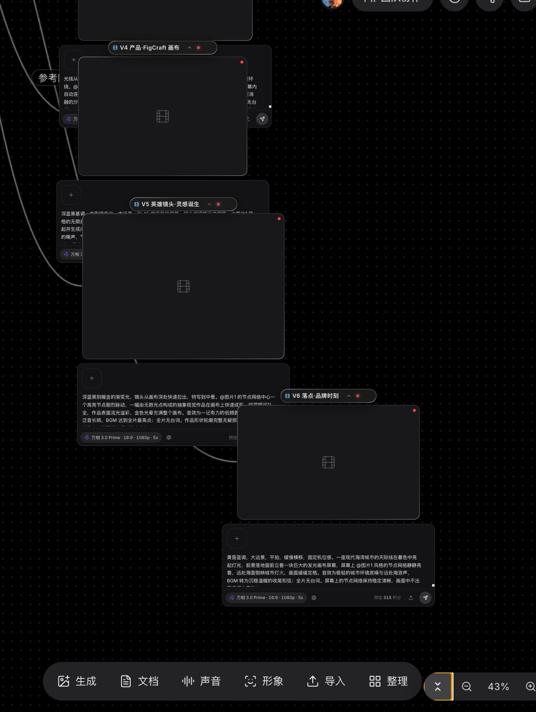
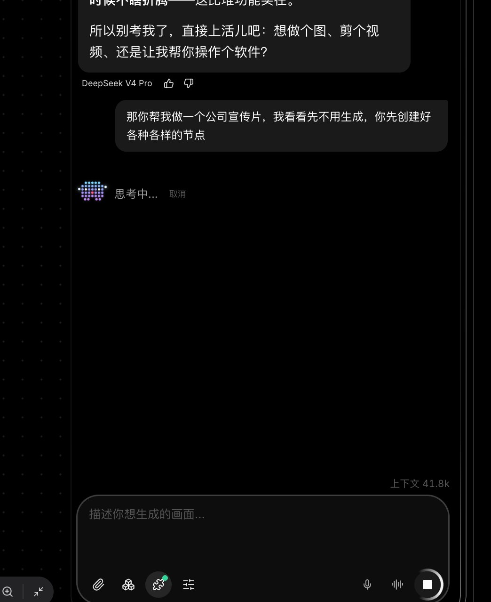
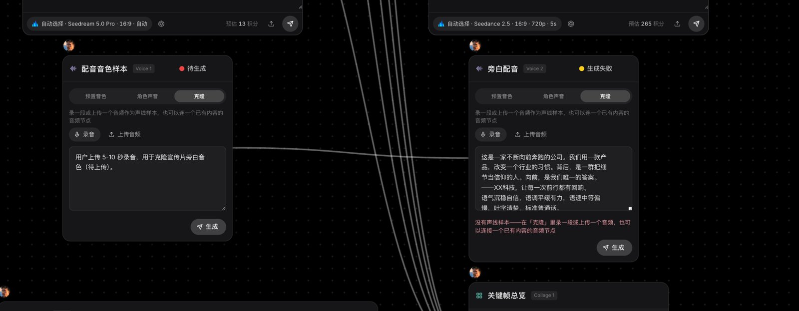
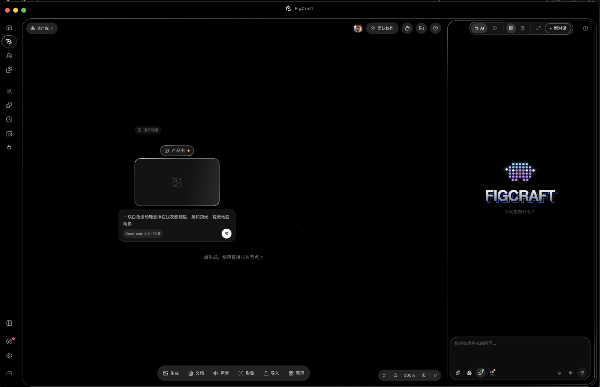

  <picture>
    <source media="(prefers-color-scheme: dark)" srcset="assets/mark-dark.png">
    
  </picture>

  <picture>
    <source media="(prefers-color-scheme: dark)" srcset="assets/wordmark-dark.png">
    
  </picture>

An image agent that works on your own machine.

  <a href="https://figcraft.ai">figcraft.ai</a> ·
  <a href="https://figcraft.cn">figcraft.cn (China mirror)</a> ·
  <a href="https://github.com/xflow-lab/figcraft-app/releases/latest">Download</a> ·
  <a href="README.md">中文</a>

  

---

## Download

| Platform | Installer |
|---|---|
| macOS (Apple silicon) | [FigCraft-2.2.5-arm64.dmg](https://github.com/xflow-lab/figcraft-app/releases/latest/download/FigCraft-2.2.5-arm64.dmg) |
| macOS (Intel) | [FigCraft-2.2.5.dmg](https://github.com/xflow-lab/figcraft-app/releases/latest/download/FigCraft-2.2.5.dmg) |
| Windows | [FigCraft-Setup-2.2.5.zip](https://github.com/xflow-lab/figcraft-app/releases/latest/download/FigCraft-Setup-2.2.5.zip) (unzip, run the exe) |
| Linux | [AppImage](https://github.com/xflow-lab/figcraft-app/releases/latest/download/FigCraft-2.2.5.AppImage) · [deb](https://github.com/xflow-lab/figcraft-app/releases/latest/download/FigCraft-2.2.5-amd64.deb) |

macOS builds are notarized by Apple; Windows builds are code-signed by QINAXIS.

## What it is

FigCraft is an **image agent** that runs on your computer: an autonomous agentic loop with a large language model as the planner. It breaks a goal such as "a set of product shots", "a brand film" or "a voice-over" into executable tool calls, lays the plan out as a node graph on an infinite canvas, and produces the images, video and speech step by step. It is not a "type a prompt, wait for a picture" web page.

### Local or cloud

Both, with a clear boundary:

| On your machine (local) | In the cloud (our API gateway) |
|---|---|
| The agent loop itself: planning, tool dispatch, result feedback, context management | LLM inference for chat/planning (DeepSeek, Claude, GPT, Qwen, Gemini, Grok) |
| Reading and writing your files, directory search (ripgrep), asset parsing | Image / video / speech generation models (Seedream, Wan, Grok Imagine, GPT Image, CosyVoice, ...) |
| Canvas, sessions, asset library, Skills, MCP connections | Accounts, credit billing, model routing and fallback, regional routes (Singapore / China nodes) |
| Generated results saved locally | Transient relay of generated results (optional object-storage links) |

In short: **reasoning and execution are local, compute is in the cloud.** Your files are not uploaded; only what you explicitly hand to a model (prompts, reference images, images to analyse) is sent as inference input.

### Technical notes

- **Agent loop** — a ReAct-style reason → tool call → observe loop with lazily loaded tools and structured tool results; up to 60 steps per turn, interruptible and resumable.
- **Hierarchical sub-agents** — complex jobs are split across sub-agents (batch generation, research) that share the main loop's tool path with a narrower tool set and a prompt written by the dispatcher.
- **Two-tier context compaction** — oversized tool results are micro-compacted in place every turn; near the context limit the whole history is auto-summarised, so long sessions keep early decisions.
- **Model fallback and retries** — upstream failures switch models along a preset chain within the same turn; streaming with idle-based (not total-duration) timeouts, so long-thinking models are not killed.
- **Canvas as a directed acyclic dataflow graph** — images, video, documents and audio are nodes; links carry typed slots (first frame / last frame / reference). References and frame slots are mutually exclusive on most video models, and the canvas validates and refuses invalid links. Auto-layout orders nodes by topological depth.
- **Consistency anchors** — multi-reference conditioning (reference count adapts to each model's limit) and character/voice binding keep subjects and style consistent across shots.
- **Permissions and approvals** — side-effecting tools go through allow / ask / deny; billable generation shows a credit estimate and an approval bar the agent cannot bypass.
- **Skills** — a way of working is a `SKILL.md` (optionally with reference documents), injected when selected; user-authored and official.
- **MCP (Model Context Protocol)** — external tool servers are called like built-in tools.
- **Voice** — zero-shot voice cloning from a 5–10 s sample, cloned once and reused across nodes and sessions.

### Screenshots

 

## Links

| | |
|---|---|
| Website | [figcraft.ai](https://figcraft.ai) · China mirror [figcraft.cn](https://figcraft.cn) |
| Company | [QINAXIS · qinaxis.com](https://qinaxis.com) |
| Our other product | [Beline · beline.ai](https://beline.ai) — an AI that runs your X (Twitter) account |
| Support | <support@qinaxis.cn> |

## About this repository

This repository holds installers, release notes and an introduction only. FigCraft is closed-source; the source code is not here and will not be pushed here.

- Feedback: <support@qinaxis.cn> or Issues
- Changelog: see [Releases](https://github.com/xflow-lab/figcraft-app/releases)

---

© 2026 QINAXIS TECHNOLOGY GROUP LIMITED. All rights reserved.

