  

<h1 align="center">FigCraft</h1>

  在你自己的电脑上干活的图像智能体。 
  An image agent that works on your own machine.

  <a href="https://figcraft.ai">figcraft.ai</a> ·
  <a href="https://figcraft.cn">figcraft.cn</a> ·
  <a href="https://github.com/xflow-lab/figcraft-app/releases/latest">Download</a> ·
  <a href="README.en.md">English</a>

---

## 下载

| 平台 | 安装包 |
|---|---|
| macOS（Apple 芯片） | [FigCraft-2.2.5-arm64.dmg](https://github.com/xflow-lab/figcraft-app/releases/latest/download/FigCraft-2.2.5-arm64.dmg) |
| macOS（Intel） | [FigCraft-2.2.5.dmg](https://github.com/xflow-lab/figcraft-app/releases/latest/download/FigCraft-2.2.5.dmg) |
| Windows | [FigCraft-Setup-2.2.5.zip](https://github.com/xflow-lab/figcraft-app/releases/latest/download/FigCraft-Setup-2.2.5.zip)（解压后运行 exe） |
| Linux | [AppImage](https://github.com/xflow-lab/figcraft-app/releases/latest/download/FigCraft-2.2.5.AppImage) · [deb](https://github.com/xflow-lab/figcraft-app/releases/latest/download/FigCraft-2.2.5-amd64.deb) |

中国大陆用户从 [figcraft.cn/download](https://figcraft.cn/download) 下载更快。macOS 包已经苹果公证，Windows 包带 QINAXIS 代码签名。

## 它是什么

FigCraft 不是又一个"输入提示词、等图"的网页。它是一个装在你电脑上的智能体：会读你的文件、看你的素材、在无限画布上把一件事拆成一组节点，然后一步步把图、视频、配音做出来。

- **无限画布**：图片、视频、文档、配音都是节点，连线就是数据流。拖一张图进来它就是一个节点，写一句话就能生成，从端口拉一根线接到视频节点就能动起来。
- **智能体在本地干活**：读本地文件、搜资料、写文档、做规划；复杂任务拆给子智能体并行。它会在需要你拍板的地方停下来问，而不是自作主张。
- **技巧（Skills）**：把一套做法（电商带货、短剧、品牌 TVC、提示词诊断……）装进来，选中即用；也可以写自己的。
- **多模型**：Seedream、万相、Grok、Gemini、GPT Image、DeepSeek、Claude、Qwen 等，按任务挑，价格透明。
- **配音**：录 5 秒你的声音，克隆一次，之后所有旁白直接用。
- **外部工具**：接 MCP 服务，智能体能直接调用。

## 这个仓库是什么

这里只放安装包、更新日志和介绍。FigCraft 是闭源软件，源代码不在这里，也不会推送到这里。

- 问题反馈：<support@qinaxis.com> 或本仓库 Issues
- 更新日志：见 [Releases](https://github.com/xflow-lab/figcraft-app/releases)

## 合规

FigCraft（图可）图像创作智能助手 · 广东省生成式人工智能服务登记号 Guangdong-FigCraft-20260817S0078

---

© 2026 QINAXIS TECHNOLOGY GROUP LIMITED. All rights reserved.

