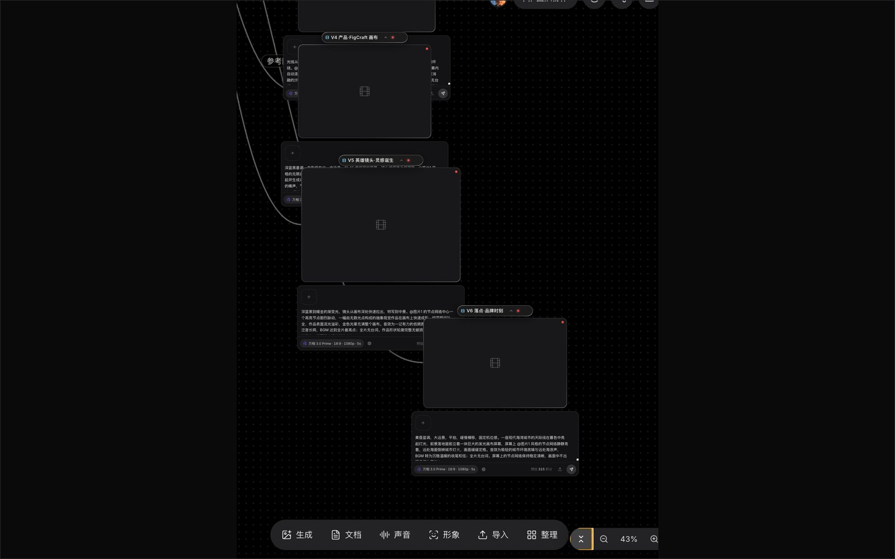
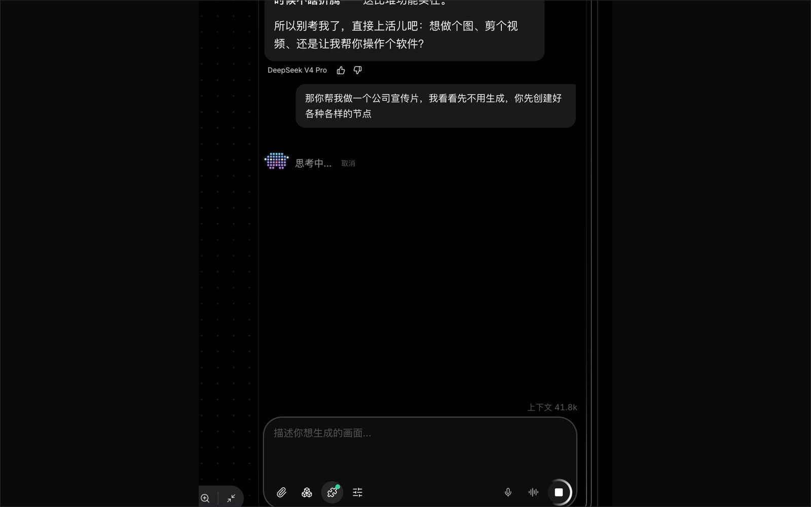
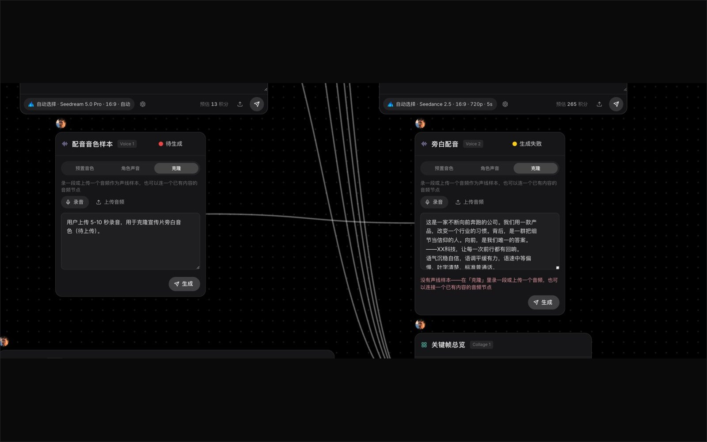
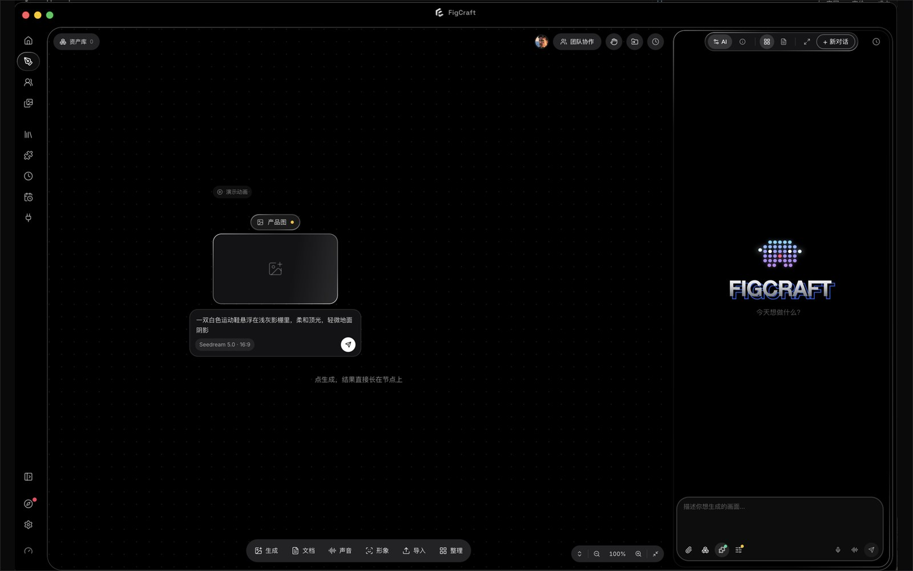

  <picture>
    <source media="(prefers-color-scheme: dark)" srcset="assets/mark-dark.png">
    
  </picture>

  <picture>
    <source media="(prefers-color-scheme: dark)" srcset="assets/wordmark-dark.png">
    
  </picture>

  在你自己的电脑上干活的图像智能体。 
  An image agent that works on your own machine.

  <a href="https://figcraft.ai">figcraft.ai</a> ·
  <a href="https://figcraft.cn">figcraft.cn（中国访问）</a> ·
  <a href="https://github.com/xflow-lab/figcraft-app/releases/latest">下载</a> ·
  <a href="README.en.md">English</a>

  

---

## 下载

| 平台 | 安装包 |
|---|---|
| macOS（Apple 芯片） | [FigCraft-2.3.0-arm64.dmg](https://github.com/xflow-lab/figcraft-app/releases/latest/download/FigCraft-2.3.0-arm64.dmg) |
| macOS（Intel） | [FigCraft-2.3.0.dmg](https://github.com/xflow-lab/figcraft-app/releases/latest/download/FigCraft-2.3.0.dmg) |
| Windows | [FigCraft-Setup-2.3.0.zip](https://github.com/xflow-lab/figcraft-app/releases/latest/download/FigCraft-Setup-2.3.0.zip)（解压后运行 exe） |
| Linux | [AppImage](https://github.com/xflow-lab/figcraft-app/releases/latest/download/FigCraft-2.3.0.AppImage) · [deb](https://github.com/xflow-lab/figcraft-app/releases/latest/download/FigCraft-2.3.0-amd64.deb) |

中国大陆用户从 [figcraft.cn/download](https://figcraft.cn/download) 下载更快。macOS 包已经苹果公证，Windows 包带 QINAXIS 代码签名。

## 它是什么

FigCraft 是一个运行在你电脑上的**图像智能体（image agent）**：一个以大语言模型为规划器的自主智能体循环（agentic loop），把"做一组商品图 / 一支宣传片 / 一段配音"这样的目标拆成可执行的工具调用，在无限画布上以节点图的形式落地，再逐步生成图像、视频和语音。它不是一个"输入提示词、等一张图"的网页。

### 本地运行还是云端运行

两者各管一半，边界很清楚：

| 在你的电脑上（本地） | 在云端（我们的 API 网关） |
|---|---|
| 智能体循环本身：规划、工具调度、结果回填、上下文管理 | 大模型推理：对话/规划模型（DeepSeek、Claude、GPT、Qwen、Gemini、Grok） |
| 读写你的文件、目录搜索（ripgrep）、素材解析 | 图像 / 视频 / 语音生成模型（Seedream、万相、Grok Imagine、GPT Image、CosyVoice 等） |
| 画布、会话、素材库、技巧（Skills）、外部工具（MCP）连接 | 账号、积分计费、模型路由与降级、跨境线路（新加坡 / 中国节点） |
| 生成结果落盘到本机 | 生成结果的临时中转（可选 OSS 直链） |

也就是说：**思考和执行在本地，算力在云端。** 你的文件不上传，只有你明确交给模型的内容（提示词、参考图、要分析的图）会作为推理输入发送。

### 技术要点

- **智能体循环**：ReAct 式的"推理 → 工具调用 → 观察"循环，工具按需懒加载，工具结果结构化回填；单轮最多 60 步，可中断、可续跑。
- **层级子智能体**：复杂任务拆给子智能体并行（如批量出图、资料检索），子智能体与主循环共用同一套工具通路，但工具集更窄、提示词由派发方给定。
- **上下文压缩（两层）**：每轮对超长工具结果做就地微压缩（microcompaction）；接近上下文上限时对整段历史做自动摘要压缩（auto-compaction），长会话不丢早期决策。
- **模型降级链与重试**：上游不可用时按预设链路自动切换模型并同轮重试；流式传输、空闲超时而非总时长超时，长思考的模型不会被误杀。
- **画布 = 有向无环数据流图（DAG）**：图片、视频、文档、音频都是节点；连线带类型化槽位（首帧 / 尾帧 / 参考），参考与首尾帧在多数视频模型上互斥，画布会直接校验并拒绝非法连线。自动布局按拓扑深度从左到右排。
- **一致性锚**：多参考图条件生成（按模型上限自适应张数）、角色/声线绑定，跨镜头保持人物与风格一致。
- **权限与审批**：副作用工具走 允许 / 询问 / 拒绝 三态权限；计费生成先出预估积分与确认条，智能体不能绕过。
- **技巧（Skills）**：一套做法就是一个 `SKILL.md`（可带参考文档），选中即注入；支持用户自建与官方发布。
- **MCP（Model Context Protocol）**：接入外部工具服务器，智能体像调用内置工具一样调用。
- **语音**：零样本声线克隆（5–10 秒样本），克隆一次、跨节点跨会话复用。

### 截图

<table>
  <tr>
    <td width="50%"></td>
    <td width="50%"></td>
  </tr>
  <tr>
    <td align="center"><b>图 1</b>　画布：智能体按镜头拆出的视频节点链，每个节点带自己的提示词与生成参数</td>
    <td align="center"><b>图 2</b>　对话面板：智能体规划中，工具调用逐步可见</td>
  </tr>
  <tr>
    <td></td>
    <td></td>
  </tr>
  <tr>
    <td align="center"><b>图 3</b>　配音节点：声线（我的声音 / 预置 / 角色）与台词，连线接入视频节点</td>
    <td align="center"><b>图 4</b>　主界面：左侧无限画布，右侧智能体面板</td>
  </tr>
</table>

## 这个仓库是什么

这里只放安装包、更新日志和介绍。FigCraft 是闭源软件，源代码不在这里，也不会推送到这里。

- 问题反馈：<support@qinaxis.cn> 或本仓库 Issues
- 更新日志：见 [Releases](https://github.com/xflow-lab/figcraft-app/releases)

## 链接

| | |
|---|---|
| 官网 | [figcraft.ai](https://figcraft.ai) · 中国访问 [figcraft.cn](https://figcraft.cn) |
| 公司 | [QINAXIS · qinaxis.com](https://qinaxis.com) |
| 我们的另一款产品 | [Beline · beline.ai](https://beline.ai) — 让 AI 替你运营 X（Twitter）账号 |
| 支持 | <support@qinaxis.cn> |

## 合规

FigCraft（图可）图像创作智能助手 · 广东省生成式人工智能服务登记号 Guangdong-FigCraft-20260817S0078

---

© 2026 QINAXIS TECHNOLOGY GROUP LIMITED. All rights reserved.

